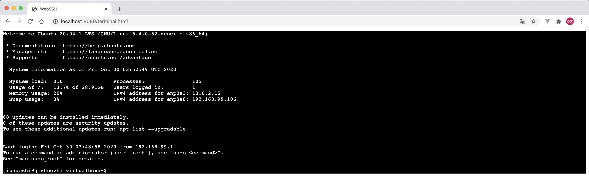

# WebSSH

## Requirement

### Compile

- Java Development Kit 11 (JDK11)
- Apache Maven
- NodeJS
- npm / yarn

### Runtime

- Java Virtual Machine 11 (JVM11)

## Package

```shell
npm --prefix src/main/resources/webssh install 
npm --prefix src/main/resources/webssh run build
mvn clean install -DskipTests
```

## Bootstrap

Before bootstrapping application, you should set environment variables to connect the remote server.

|Variable|Type|Description|Default Value|
|---|---|----|---|
|webssh.auto|Boolean|Whether auto create connection|false|
|webssh.hostname|String|Remote server host likes ip and domain name|localhost|
|webssh.port|Int|Remote server port|22|
|webssh.username|String|Remote server username|root|
|webssh.password|String|Remote server password for username|No default value, using private key if not set|
|webssh.enabled|Boolean|Whether WebSSH enabled|false|

Then execute this command

```shell
java -jar target/webssh-*.jar
```

Now [WebSSH](http://localhost:8080/terminal.html) is available and automatic connect to your remote server.



## Docker

    Project provides an all-in-one Dockerfile, both frontend and backend compilations.

```shell
docker build -t webssh .
docker run -d webssh \
 -p 8080:8080 \
 webssh \
 --webssh.hostname=localhost \
 --webssh.port=22 \
 --webssh.username=root \
 --webssh.password=root 
```

Could also use .env file to set up the webssh configurations instead of command line arguments

```shell
cat > .env <<EOF
webssh.hostname=localhost
webssh.port=22
webssh.username=root
webssh.password=root
EOF
docker run -d webssh \
 -p 8080:8080 \
 --env-file .env \
 webssh
```
